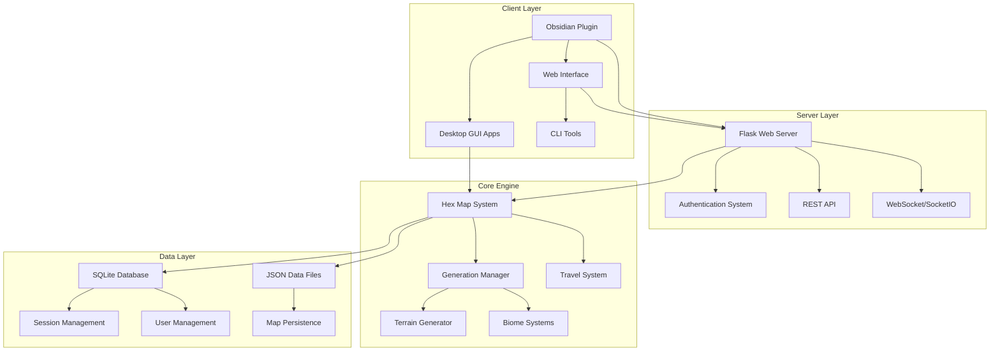

# Hexcrawl Project - Detailed Architecture Analysis

## Project Overview

This is a comprehensive tabletop RPG hexcrawl exploration system with both standalone desktop applications and an integrated Obsidian plugin for campaign management. The architecture follows a client-server model with multiple interface options.

## High-Level Architecture



## 1. Backend Architecture (Flask Server)

### Main Server (`app.py` - 49KB)
- **Flask Web Application** with extensive middleware stack:
  - **CORS** for cross-origin requests (Obsidian plugin support)
  - **SocketIO** for real-time multiplayer features
  - **Flask-Login** for session management
  - **Rate Limiting** for API protection
  - **Security Headers** via Talisman
  - **CSRF Protection** for web forms

### Authentication System (`auth.py` - 20KB)
- **JWT-based authentication** for API clients (Obsidian plugin)
- **Session-based authentication** for web interface
- **User registration and profile management**
- **Password hashing** with secure algorithms
- **Token management** with expiration and refresh

### Core Systems

#### Map Management (`core/map.py`)
- **HexMap class** - Central map data structure
- **Hex coordinate system** - Cube coordinates (q, r, s)
- **Player position tracking** with multiplayer support
- **Map persistence** via JSON serialization
- **Travel system integration**

#### Hex System (`core/hex.py`)
- **Individual hex representation**
- **Terrain and biome data**
- **Feature management** (settlements, dungeons, etc.)
- **Exploration state tracking**

#### Generation System (`generation/`)
- **GenerationManager** - Orchestrates all generation processes
- **Multiple terrain generators**:
  - Basic terrain generation
  - **Minecraft-style biome generation** (6D noise)
  - **Advanced terrain features**
- **Ollama Client** - AI-powered description generation
- **Configurable generation parameters**

### Database Layer (`models.py`)
- **SQLAlchemy ORM** with SQLite backend
- **User model** with authentication fields
- **Game session management**
- **Migration support** via Flask-Migrate

## 2. Frontend Architecture (Obsidian Plugin)

### Plugin Structure (`obsidian-hexcrawl-plugin/`)
```
src/
├── main.ts              # Main plugin class and API client
├── authView.ts          # Authentication interface
├── hexcrawlView.ts      # Main game interface
├── customHexMap.ts      # Custom hex map renderer
└── types.ts             # TypeScript type definitions
```

### Main Plugin (`main.ts`)
- **Plugin lifecycle management**
- **Axios-based API client** with JWT authentication
- **Settings management** with encrypted token storage
- **Authentication flow** with auto-login support
- **Session management** with server synchronization

### Authentication View (`authView.ts`)
- **Login/Registration forms**
- **Session joining by ID** (no new game creation)
- **User profile management**
- **Authentication state display**

### Map View (`hexcrawlView.ts`)
- **Custom hex map renderer** (replacing Leaflet dependency)
- **Interactive controls** (movement, zoom, pan)
- **Game actions** (description generation, note synchronization)
- **Real-time map updates**

### Build System
- **TypeScript compilation** with ESBuild
- **Automated deployment** to Obsidian plugin directory
- **Development mode** with file watching

## 3. Standalone Applications

### Multiple Generator Variants
The project includes **10+ different map generators**, each specialized for different use cases:

1. **`hex_map_generator_simple.py`** - Basic terrain generation
2. **`hex_map_generator_minecraft.py`** - Minecraft-style biomes
3. **`hex_map_generator_pygame.py`** - Visual rendering with Pygame
4. **`hex_map_generator_stable.py`** - Stable generation algorithms
5. **`hex_map_generator_hexchunks.py`** - Chunk-based generation
6. **`hex_map_generator_gui.py`** - GUI interface
7. **`hex_map_generator_cli.py`** - Command-line interface
8. And several others for different scenarios...

### Desktop Explorer (`hex_map_explorer.py` - 89KB)
- **Tkinter-based GUI** application
- **Local map management** without server dependency
- **Export capabilities** (images, JSON, text-mapper format)
- **Integrated generation tools**

### Main Menu System (`main_menu.py` - 54KB)
- **Unified launcher** for all tools
- **Configuration management**
- **Tool selection interface**

## 4. Data Architecture

### Map Data Format
```json
{
  "hexes": [
    {
      "x": 0, "y": 0,
      "terrain": "grassland",
      "biome": "temperate_plains", 
      "elevation": 150,
      "features": ["settlement"],
      "explored": true,
      "description": "AI-generated description"
    }
  ],
  "player_position": {"x": 0, "y": 0},
  "map_name": "session_id",
  "metadata": {...}
}
```

### Database Schema
```sql
-- Users table
CREATE TABLE users (
    id INTEGER PRIMARY KEY,
    username VARCHAR(80) UNIQUE,
    email VARCHAR(120) UNIQUE,
    password_hash VARCHAR(255),
    player_color VARCHAR(7),
    is_game_master BOOLEAN,
    created_at TIMESTAMP
);

-- Game sessions and map data stored as JSON
-- Player positions tracked per session
```

## 5. Communication Architecture

### API Endpoints
```
Authentication:
POST /api/auth/register     # User registration
POST /api/auth/login        # JWT authentication
GET  /api/auth/me          # User profile
GET  /api/auth/session-debug # Debug endpoint

Map Operations:
GET  /api/load_map_data/:session_id    # Load map
POST /api/move_player/:direction       # Player movement
POST /api/generate_hex_description     # AI descriptions
POST /api/update_hex                   # Hex modifications

Session Management:
POST /api/create_map_session          # New game session
POST /api/join_game_session/:id       # Join existing session
GET  /api/get_player_positions/:id    # Multiplayer positions
```

### WebSocket Events (SocketIO)
```javascript
// Real-time multiplayer synchronization
socket.on('player_moved', (data) => updatePlayerPosition(data))
socket.on('hex_updated', (data) => refreshHexData(data))
socket.on('session_joined', (data) => handleNewPlayer(data))
```

## 6. Security Architecture

### Authentication & Authorization
- **JWT tokens** for API authentication (Obsidian plugin)
- **Session cookies** for web interface
- **Password hashing** with secure algorithms
- **Rate limiting** on authentication endpoints
- **CORS configuration** for cross-origin requests

### Data Protection
- **Input validation** with schemas (`validation_schemas.py`)
- **SQL injection prevention** via SQLAlchemy ORM
- **XSS protection** with template escaping
- **CSRF tokens** for form submissions
- **Secure headers** via Talisman middleware

### Security Configuration (`config/security_config.py`)
- **Environment-based configuration**
- **Security policy definitions**
- **Encryption key management**

## 7. Generation Pipeline Architecture

### Multi-Stage Generation Process
```python
1. World Generation
   ├── Continental structure (2+ continents)
   ├── Climate zones
   └── Base terrain types

2. Biome Assignment
   ├── Temperature/humidity calculations
   ├── Noise-based variation
   └── Minecraft-style biome mapping (optional)

3. Feature Placement
   ├── Settlement generation
   ├── Dungeon/ruin placement
   └── Natural features

4. AI Enhancement
   ├── Ollama integration for descriptions
   ├── Context-aware content generation
   └── Fallback to template-based descriptions
```

### Generation Manager (`generation/manager.py`)
- **Coordinates all generation systems**
- **Manages generation parameters**
- **Handles caching and optimization**
- **Provides async generation capabilities**

## 8. File Organization & Module Structure

### Core Modules
```
core/                    # Core game logic
├── hex.py              # Individual hex representation
└── map.py              # Map data structure

generation/             # Content generation
├── manager.py          # Generation orchestration
├── terrain_generator.py # Terrain algorithms
├── minecraft_biomes.py # Biome generation
└── ollama_client.py    # AI integration

config/                 # Configuration management
├── constants.py        # Game constants
└── security_config.py  # Security settings

application/            # Desktop applications
utils/                  # Utility functions
travel/                 # Travel mechanics
rendering/              # Map visualization
```

### Standalone Applications
- **10+ specialized generators** for different use cases
- **Desktop GUI applications** with Tkinter
- **Command-line tools** for automation
- **Export utilities** (text-mapper, images, JSON)

## 9. Deployment & Infrastructure

### Development Environment
- **Python Flask** development server
- **TypeScript compilation** with ESBuild
- **Automated deployment** to Obsidian
- **Hot reloading** for development

### Production Considerations
- **WSGI compatibility** for production deployment
- **Database migrations** via Flask-Migrate
- **Environment variable configuration**
- **Logging and monitoring** infrastructure

### Build Process
```bash
# Backend (Python)
python app.py                           # Start Flask server

# Frontend (Obsidian Plugin)
npm run build                          # Compile TypeScript
npm run deploy                         # Deploy to Obsidian

# Standalone Applications
python hex_map_generator_*.py          # Various generators
python main_menu.py                    # Unified launcher
```

## 10. Key Architectural Decisions

### Strengths
1. **Modular Design** - Clear separation of concerns
2. **Multiple Interfaces** - Desktop, web, and Obsidian integration
3. **Extensible Generation** - Multiple generation algorithms
4. **Real-time Multiplayer** - SocketIO for synchronization
5. **Comprehensive Security** - Multiple security layers
6. **AI Integration** - Ollama for enhanced content

### Technical Debt & Areas for Improvement
1. **Code Duplication** - 10+ similar generators could be consolidated
2. **Mixed Authentication** - Both JWT and sessions increase complexity
3. **Large Files** - Some modules are becoming unwieldy (app.py: 49KB)
4. **Build Complexity** - Manual TypeScript compilation process
5. **Documentation** - Some modules lack comprehensive documentation

### Scalability Considerations
1. **Database** - SQLite suitable for development, may need PostgreSQL for production
2. **Session Storage** - In-memory storage limits horizontal scaling  
3. **File Storage** - Map data stored as files, consider database storage
4. **API Rate Limiting** - Current limits may need adjustment for production

## Conclusion

This hexcrawl system demonstrates a sophisticated architecture that successfully integrates multiple client interfaces with a robust backend. The modular design allows for extensive customization while maintaining code organization. The dual authentication system supports both traditional web usage and modern API-based integrations like the Obsidian plugin.

The architecture's main strength is its flexibility - users can choose from desktop applications, web interfaces, or integrated note-taking workflows. However, consolidating the numerous similar generators and streamlining the authentication approach would improve maintainability.